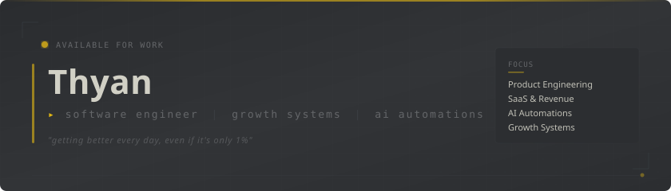
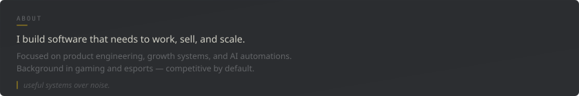
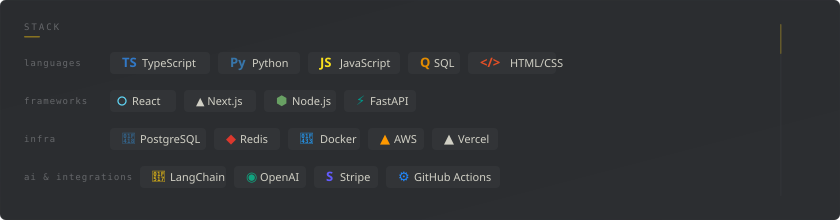

<picture>
  
</picture>

 

  
  &nbsp;&nbsp;
  
  &nbsp;&nbsp;
  

 

<!-- ═══════════════════════════════════════ ABOUT ═══════════════════════════════════════ -->

  

<!-- ═══════════════════════════════════════ NOW ═══════════════════════════════════════ -->

  

<!-- ═══════════════════════════════════════ STACK ═══════════════════════════════════════ -->

&nbsp;&nbsp;▸ tech stack

 

 

<!-- ═══════════════════════════════════════ METRICS ═══════════════════════════════════════ -->

&nbsp;&nbsp;▸ github metrics

 

  
  &nbsp;
  

 

<!-- ═══════════════════════════════════════ CONTRIBUTIONS ═══════════════════════════════════════ -->

&nbsp;&nbsp;▸ contribution map

 

<picture>
  <source media="(prefers-color-scheme: dark)" srcset="https://raw.githubusercontent.com/Thyanri/Thyanri/output/github-contribution-grid-snake-dark.svg"/>
  <source media="(prefers-color-scheme: light)" srcset="https://raw.githubusercontent.com/Thyanri/Thyanri/output/github-contribution-grid-snake.svg"/>
  
</picture>

 

<!-- ═══════════════════════════════════════ FEATURED ═══════════════════════════════════════ -->

&nbsp;&nbsp;▸ featured work

 

<table>
  <thead>
    <tr>
      <th align="left">project</th>
      <th align="left">focus</th>
      <th align="center">status</th>
    </tr>
  </thead>
  <tbody>
    <tr>
      <td><strong>project name</strong></td>
      <td>saas · growth</td>
      <td align="center"><code>active</code></td>
    </tr>
    <tr>
      <td><strong>project name</strong></td>
      <td>ai automation</td>
      <td align="center"><code>active</code></td>
    </tr>
    <tr>
      <td><strong>project name</strong></td>
      <td>internal tooling</td>
      <td align="center"><code>shipped</code></td>
    </tr>
  </tbody>
</table>

replace placeholders with actual projects when ready

 

<!-- ═══════════════════════════════════════ FOOTER ═══════════════════════════════════════ -->

